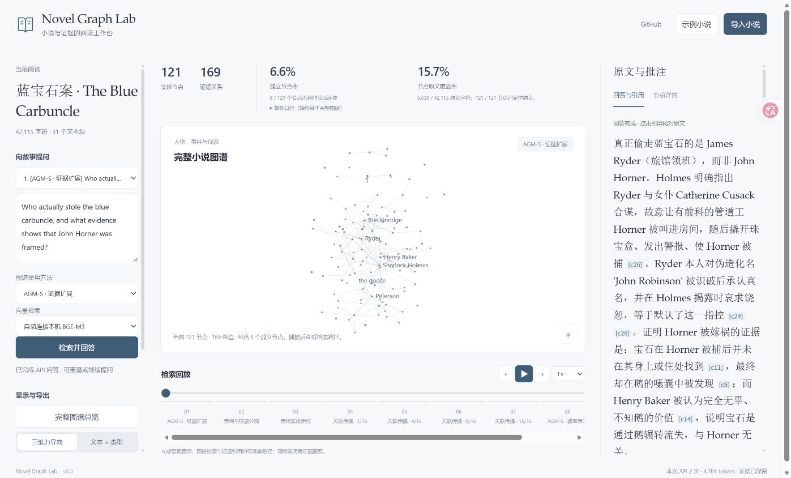
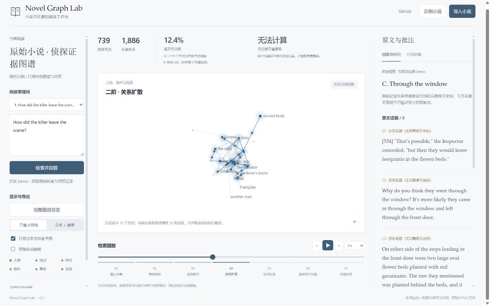

# Novel Graph Lab

**Lee toda la historia. Sigue la evidencia.**

Convierte novelas largas en grafos de conocimiento reutilizables, consulta el texto original con preguntas y reproduce las rutas de evidencia mediante una animación 3D.

[Demo interactiva](https://fuxiaoji.github.io/novel-graph-lab/) · [English](README.md) · [简体中文](README.zh-CN.md) · [日本語](README.ja.md) · [Descargas y Skill](https://github.com/fuxiaoji/novel-graph-lab/releases)

[](https://fuxiaoji.github.io/novel-graph-lab/)

## Prueba la demo

La versión online no requiere cuenta ni clave de API, e incluye la demo de investigación original: **739 nodos, 1.886 aristas y 7 preguntas guardadas**.

- Primero se muestra el grafo completo de fuerzas dirigidas, incluidos **92 nodos aislados (12,4 %)**.
- Arrastra para rotar, usa la rueda para hacer zoom y haz clic en un nodo para ver su evidencia y relaciones.
- Selecciona una pregunta y reproduce la animación de recuperación: pausa, paso a paso, cambio de velocidad y línea de tiempo arrastrable.
- Por defecto se resalta la recuperación sobre el grafo completo; el subgrafo de la pregunta solo se activa si lo marcas explícitamente.
- Los puntos de luz representan rutas de recuperación y citación observables; el texto es un resumen de la evidencia, no el razonamiento privado del modelo.

La demo online solo reproduce registros históricos y no acepta claves de API. Para importar tu propia novela o hacer preguntas reales, ejecuta la aplicación local.



## Empieza en tres pasos

Solo necesitas **Python 3.10+**. Para ejecutar el proyecto no hacen falta paquetes de terceros, Node, dependencias frontend ni CDN.

```bash
git clone https://github.com/fuxiaoji/novel-graph-lab.git
cd novel-graph-lab
python server.py --open
```

En Windows también puedes hacer doble clic en `start.cmd`. Se abre [127.0.0.1:8765](http://127.0.0.1:8765) por defecto; si el puerto está ocupado, usa `--port 8767`.

1. Haz clic en «Importar» y elige un archivo TXT / Markdown, en UTF-8 o GB18030.
2. Introduce la base URL compatible con Chat Completions, el ID del modelo y la clave de API. Los modelos locales pueden dejar la clave vacía.
3. Escribe una pregunta y pulsa «Recuperar y responder». La primera ejecución construye el grafo por bloques; las siguientes lo reutilizan.

La API usa `POST {base_url}/chat/completions` y requiere soporte para `model`, `messages`, `max_tokens` e instrucciones JSON. Escribe el nombre real del modelo que ofrece tu proveedor; no se implementan extensiones propietarias. Las API remotas requieren HTTPS; los modelos locales pueden usar HTTP en localhost. [Referencia del protocolo](https://api-docs.deepseek.com/api/create-chat-completion/)

## Cómo ayuda el grafo a responder preguntas

**Texto completo en bloques → extracción con LLM → verificación literal de citas → grafo completo → planificación de consulta → BM25 → dos rondas de expansión por el grafo → recuperación complementaria del texto original → respuesta con citas.**

Se conservan personas, lugares, tiempos, objetos, eventos, testimonios y contradicciones. El texto original no se elimina de antemano, por lo que lo que la extracción pase por alto puede recuperarse del texto original. El chino se segmenta en bigramas y el inglés se empareja por palabras.

En los grafos nuevos, cada cita de nodo o arista debe existir literalmente en su bloque, y las relaciones guardan posiciones de caracteres. Los nombres solo se normalizan en mayúsculas y espacios; los alias participan en la búsqueda sin fusionar automáticamente identidades ambiguas. Las citas inexistentes se marcan en la respuesta.

## Definición de las métricas

| Métrica | Definición |
| --- | --- |
| Nodos y aristas | Total del grafo completo; no cambia al filtrar un subgrafo |
| Tasa de nodos aislados | Nodos sin conexión a otro nodo / total de nodos; los bucles propios no cuentan como conexión a otro nodo |
| Cobertura del texto original | Unión de los intervalos de caracteres citados por los nodos / longitud total del texto; los solapamientos cuentan una sola vez |
| No disponible | Cuando falta el texto completo o las posiciones; la longitud de un extracto no sustituye a la del texto completo |

La demo antigua no guardó el texto completo ni las posiciones, por lo que su cobertura se muestra como «no disponible». Las novelas recién importadas sí la calculan. La cobertura de citas no equivale a la precisión de las respuestas.

## Guardar, reutilizar y Skill

- «Guardar grafo y preguntas» exporta JSON; cárgalo después para seguir preguntando.
- «Exportar replay interactivo» genera un HTML autocontenido, que puede abrirse offline y compartirse.
- Las exportaciones web también se escriben en `outputs/exports/` local.
- La CLI guarda `graph.json` antes de responder, así que un fallo en la respuesta no pierde el grafo ya construido.

Guarda la clave en la variable de entorno `NOVEL_API_KEY`; no la pongas en argumentos de comandos ni en el repositorio. `NOVEL_API_BASE` y `NOVEL_API_MODEL` definen valores por defecto.

```bash
python cli.py --novel novel.txt --question "¿Cómo salió el asesino?" --base-url https://your-provider.example/v1 --model YOUR_MODEL --out outputs/my-novel
python cli.py --graph outputs/my-novel/graph.json --question "¿Qué testimonios se contradicen?" --model YOUR_MODEL --out outputs/question-2
```

El dominio de ejemplo es un marcador de posición: sustitúyelo por tu API real. La codificación se indica con `--encoding gb18030`. Una ejecución correcta produce `graph.json`, `session.json` y `replay.html`.

Descarga `novel-graph-lab-skill.zip` desde [Releases](https://github.com/fuxiaoji/novel-graph-lab/releases) y descomprímelo en tu directorio de skills, por ejemplo `~/.codex/skills/`. Se invoca como `$novel-graph-lab`, y `NOVEL_GRAPH_LAB_HOME` permite indicar la ubicación del proyecto. El paquete incluye una plantilla ejecutable.

## Costes, privacidad y límites

Por defecto cada bloque tiene unos 5.000 caracteres: aproximadamente una petición de extracción por bloque sin caché y dos peticiones por pregunta, con reintentos limitados ante errores de red o límites de uso. La caché de bloques completados se reutiliza. La cancelación surte efecto cuando la petición en curso regresa. Los archivos de entrada se limitan a 20 MB y las peticiones a 40 MB.

La clave permanece solo en la memoria de la página y del trabajo actual; no se escribe en cachés, registros ni exportaciones. Al ejecutar una tarea, los bloques de la novela y las preguntas se envían al endpoint que configures. Las cachés y los grafos exportados pueden contener el texto de la novela. El servidor solo escucha en 127.0.0.1 y no está preparado para un despliegue público multiusuario.

Esto es un prototipo de investigación funcional. Los presupuestos fijos de recuperación, la extracción local y los nombres ambiguos pueden provocar omisiones. Que una cita exista no garantiza que la relación o la respuesta sean correctas. Los flujos están verificados con pruebas automáticas y una API local simulada, pero **no se afirma precisión con modelos reales, rendimiento con millones de caracteres ni superioridad sobre otros métodos**. Las animaciones históricas se reconstruyen a partir de nodos guardados y aristas reales, sin inventar registros o planes que faltan.

## Desarrollo y origen

```bash
python -m unittest discover -s tests -v
node tests/test_graph_utils.cjs
python tools/build_demo.py --public --out docs/index.html
```

Node solo se usa para las pruebas del frontend. Más detalles en la [documentación en inglés](README.md), el [registro de verificación](QA.md), las [notas de diseño](docs/design.md) y la [guía de contribución](CONTRIBUTING.md).

El proyecto se extrajo del panel de investigación [Novel KG Studio](https://github.com/fuxiaoji/novel-kg-studio) del autor y se reescribió de forma independiente el servidor local, la verificación de evidencia, la recuperación y la interfaz. El código de la aplicación usa la [licencia MIT](LICENSE); los extractos literarios se describen en [NOTICE.md](NOTICE.md).

Las pruebas automáticas de GitHub aún no están activadas. Se incluye una [plantilla de CI](docs/tests.workflow.yml); cópiala en `.github/workflows/tests.yml` con credenciales con permiso de workflow para activar las pruebas de Python 3.10 / 3.13.
