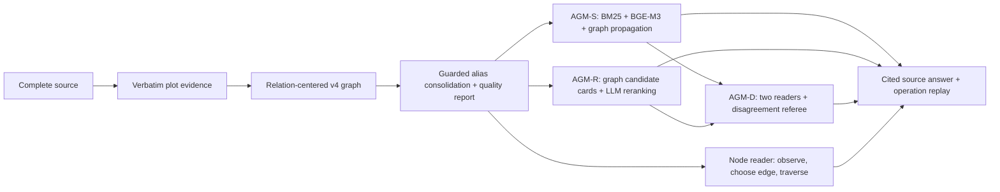

<p align="center"></p>

<h1 align="center">Novel Graph Lab</h1>

<p align="center">Read the whole story. Follow the evidence.</p>

<p align="center">A local workspace for turning long novels into evidence-grounded knowledge graphs,<br>asking questions, and replaying retrieval through an interactive 3D graph.</p>

<p align="center"><a href="https://fuxiaoji.github.io/novel-graph-lab/">Interactive demo</a> · <a href="#quick-start">Quick start</a> · <a href="README.zh-CN.md">中文说明</a> · <a href="README.ja.md">日本語</a> · <a href="README.es.md">Español</a> · <a href="https://github.com/fuxiaoji/novel-graph-lab/releases">Downloads</a></p>

<p align="center">


<a href="LICENSE"></a>
</p>

[](https://fuxiaoji.github.io/novel-graph-lab/)

## Why

A novel is linear; its evidence is not. Novel Graph Lab builds a reusable relation-centered graph from the full source and offers four evidence-reading strategies. The default view keeps the entire graph visible, including isolated nodes. Animations replay actual retrieval operations and brief evidence summaries, not private model reasoning.

**v0.3 corrects the original demo packaging.** The former release used an early graph and simplified retrieval. This version ports the later research pipeline and regenerates both the graph and all example answers. See [kernel lineage and differences](docs/kernel.md).

## Try it

The [online demo](https://fuxiaoji.github.io/novel-graph-lab/) runs entirely in the browser and needs no account or API key. It contains a **newly built graph of the complete Blue Carbuncle story and 12 real GLM-4.7 answers (3 questions × 4 methods)**.

1. Explore the full force-directed graph. Drag to rotate, scroll to zoom, and click a node to read its evidence.
2. Select a saved question and press play. Pause, change speed, move through steps, or scrub the timeline.
3. Enable the query subgraph only when you want to focus. Graph statistics always describe the complete graph.

The hosted demo replays these new API operation records. To import your own novel or call an LLM, run the local app below. The public demo does not accept API credentials.


## What you can do

| Capability | What it does |
| --- | --- |
| Read the entire graph | A deterministic 3D force layout with springs, repulsion and centering; isolated nodes stay visible. |
| Inspect graph health | Node/edge counts, isolated-node rate, and deduplicated source-character coverage. |
| Import a long novel | TXT/Markdown; verbatim evidence selection, relation-centered v4 extraction, guarded person consolidation, reusable caches. |
| Ask grounded questions | AGM-S evidence expansion, AGM-R graph metadata reranking, AGM-D disagreement arbitration, or per-node tool navigation. |
| Follow the evidence | Click citations or nodes to inspect quotes, relations and available source offsets. |
| Replay retrieval | Moving points along recorded edges, step controls, speed control and a scrubber. |
| Save and reuse | Export graph/session JSON and self-contained HTML. Reimport a graph to ask another question. |
| Use an agent skill | A portable `novel-graph-lab` skill for UI launch, batch processing and evidence-aware maintenance. |

## Quick start

**Requires Python 3.10+. No `pip install`, Node build step or CDN is needed to run the app.**

```bash
git clone https://github.com/fuxiaoji/novel-graph-lab.git
cd novel-graph-lab
python server.py --open
```

On Windows, you can also double-click `start.cmd`. Open [localhost:8765](http://127.0.0.1:8765) if the browser does not open automatically. Use `--port 8767` if the default port is busy.

Click **导入小说** (Import novel), choose a text file, and enter your API base URL, model ID and key. Enter a question and click **检索并回答** (Retrieve and answer). A first run builds the graph; subsequent questions reuse it.

The adapter uses the Chat Completions protocol: `POST {base_url}/chat/completions`, `model`, `messages`, `max_tokens`, and JSON instructions. The endpoint must support those fields and return JSON content. Remote endpoints require HTTPS; local models can use HTTP on localhost. GLM models additionally receive `thinking: {type: "disabled"}` and JSON output mode; exported traces contain tool operations and evidence summaries. See the [protocol reference](https://api-docs.deepseek.com/api/create-chat-completion/).

### Command line

Provide the key through `NOVEL_API_KEY` in your environment. Optional `NOVEL_API_BASE` and `NOVEL_API_MODEL` set defaults. Do not put real keys in shell history or committed files.

```bash
python cli.py --method agm_d --novel novel.txt --question "How did the killer leave?" \
  --base-url https://your-provider.example/v1 --model YOUR_MODEL \
  --out outputs/my-novel

python cli.py --graph outputs/my-novel/graph.json \
  --question "Which accounts contradict each other?" --model YOUR_MODEL \
  --out outputs/next-question
```

The endpoint is a placeholder: use your provider's actual URL. For GB18030 input, add `--encoding gb18030`. Outputs are `graph.json`, `session.json`, and `replay.html`. The graph is saved before answering, so an answer failure does not discard a completed graph.

### Agent skill

Download `novel-graph-lab-skill.zip` from [Releases](https://github.com/fuxiaoji/novel-graph-lab/releases) and extract its `novel-graph-lab` folder into your agent's skill directory, for example `~/.codex/skills/`. The archive includes a runnable project template.

Invoke `$novel-graph-lab` with your novel and question. Set `NOVEL_GRAPH_LAB_HOME` to use a particular checkout. The source is in [`skill/novel-graph-lab`](skill/novel-graph-lab).

## How it works



Default extraction uses 1,500-character blocks with 100-character overlap. Both passes validate literal source spans; the complete source remains available. The graph carries typed relations, source offsets, confidence and decoy metadata. Quality reports retain isolated nodes instead of deleting them to improve a metric.

AGM-S combines option-conditioned (or neutral-facet) BM25, BGE-M3 and 16-round personalized PageRank with reciprocal-rank fusion. AGM-R schedules up to eight passages from 28 graph candidate cards. AGM-D compares two independent readers and calls an evidence referee on disagreement. Tool navigation reads one node at a time and accepts only a real edge adjacent to that node, with an eight-node budget and cycle protection.

These are portable adaptations of the later G7/G9/G10 and agentic traversal implementations, not claims of bit-for-bit benchmark reproduction. [Method provenance, historical results and adaptations](docs/kernel.md).

### Local vectors

For the original three-channel configuration, install [Ollama](https://ollama.com/) and run:

```bash
ollama pull bge-m3
ollama serve
```

The public demo was generated with BGE-M3. The UI's automatic mode reports a visible warning if it falls back to BM25 + graph. Use **Require BGE-M3** / `--dense-mode required` to fail instead of falling back. No embedding service is needed for per-node navigation. Python itself still uses only the standard library.

### What the metrics mean

- **Isolated-node rate:** nodes with no connection to another node / all nodes. Self-loops do not count as another-node connections.
- **Source coverage:** union of the source-character intervals quoted by nodes / full source length. Overlapping quotes count once; chunk sizes do not count as evidence coverage. It is not an accuracy score.
- **Unavailable:** the historical demo lacks complete source text and verifiable positions, so coverage is intentionally unavailable. Its isolated-node rate is **92 / 739 = 12.4%**.

## Scope, costs and privacy

This is a working research prototype, **not a benchmark claim**. Fixed candidate budgets, local extraction and unresolved aliases can miss long-range connections. Quote validation proves that text exists, not that a relation or answer is correct. Tests use a deterministic local fixture; the public example additionally contains real GLM-4.7 runs. Neither proves benchmark accuracy or million-character performance.

Default chunks are 1,500 characters. Expect two requests per uncached block plus person consolidation; question answering uses roughly 2–10 requests depending on method, plus bounded transient retries. Larger books take longer and cost more. File input is limited to 20 MB and requests to 40 MB. Cancellation takes effect after an in-flight provider request returns.

The server binds to `127.0.0.1` and checks Host/Origin. Keys stay in browser/current-job memory, not exports, caches or logs. Text chunks and questions are sent to your configured endpoint when you run a task. Caches and exported graphs can contain novel text. This prototype is not hardened for public multi-user server deployment.

## Development

```bash
python -m unittest discover -s tests -v
node tests/test_graph_utils.cjs
python tools/build_demo.py --public --out docs/index.html
```

Node is only used for dependency-free frontend tests. A [GitHub Actions template](docs/tests.workflow.yml) targets Python 3.10 and 3.13; automated CI is not enabled. To enable it, copy the template to `.github/workflows/tests.yml` using credentials with workflow permission. Tests include Unicode offsets, quote rejection, cache reuse, graph-hop integrity, cancellation, HTTP round trips, credential exclusion, coverage deduplication and deterministic layout.

| Path | Purpose |
| --- | --- |
| `core.py`, `kernel_build.py`, `kernel_retrieve.py` | Extraction, validation, caching, retrieval and answering |
| `server.py` / `cli.py` | Local UI server and batch entry point |
| `web/` | Vanilla JS, Canvas 3D projection and reading interface |
| `examples/demo.json` | Historical graph and question records |
| `tools/` | Demo extraction, static build and distribution packaging |
| `skill/` | Portable agent workflow |
| `docs/` | Demo, screenshots and design notes |

See [CONTRIBUTING.md](CONTRIBUTING.md), [QA.md](QA.md), and [design notes](docs/design.md). Useful next steps are better alias resolution, scalable layout and evaluated retrieval coverage; these are not advertised as implemented features.

## Origin and license

Extracted from the author's [Novel KG Studio](https://github.com/fuxiaoji/novel-kg-studio) research dashboard and reworked into a standalone app. Traversal animations reconstruct connections from saved nodes and real edges, rather than inventing missing original execution logs.

Application code is [MIT licensed](LICENSE). Bundled literary excerpts are source material, not newly authored application code; see [NOTICE.md](NOTICE.md). Use **Cite this repository** for the software citation.

## Reproduce the new demo

The bundled source is the **complete short story** *The Adventure of the Blue Carbuncle* by Arthur Conan Doyle, from [Project Gutenberg](https://www.gutenberg.org/ebooks/1661). This is an end-to-end integration example, not a long-context benchmark. Three questions are fixed before running; each runs through all four methods. We retain all outputs, including uncertainties and unsuccessful navigation, without selecting only successful answers.

```bash
# Set NOVEL_API_KEY in the process environment; do not place it in a command argument.
python tools/run_demo.py --model glm-4.7
# After inspecting outputs/v3/session.json, copy it to examples/demo.json.
python tools/build_demo.py --public --out docs/index.html
```

[Run manifest](examples/demo-manifest.json) · [Complete source](examples/blue-carbuncle.txt) · [Graph and all answers](examples/demo.json)
